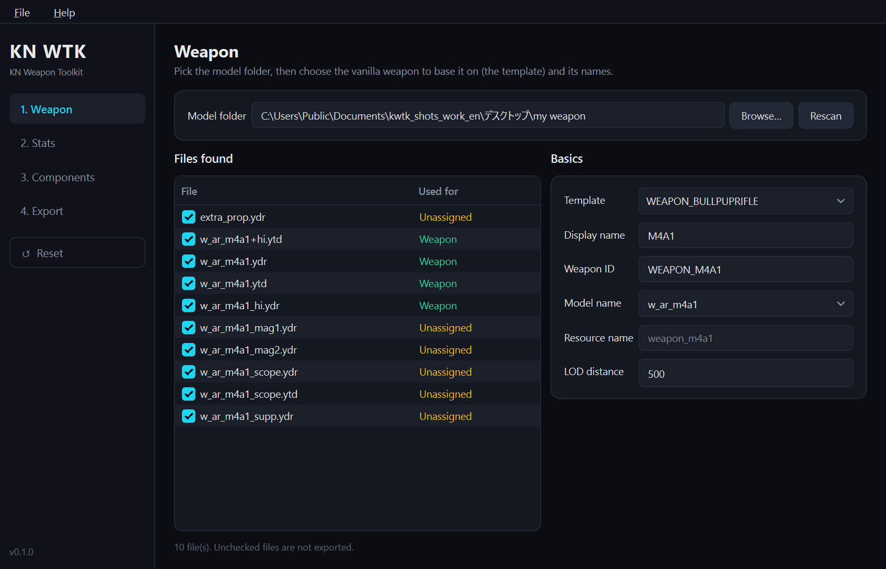
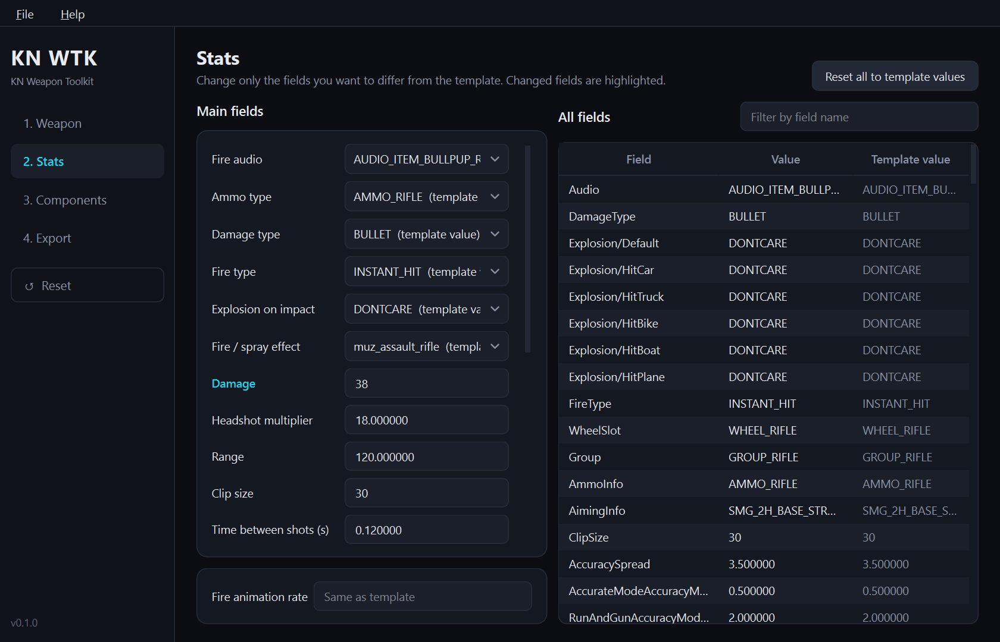
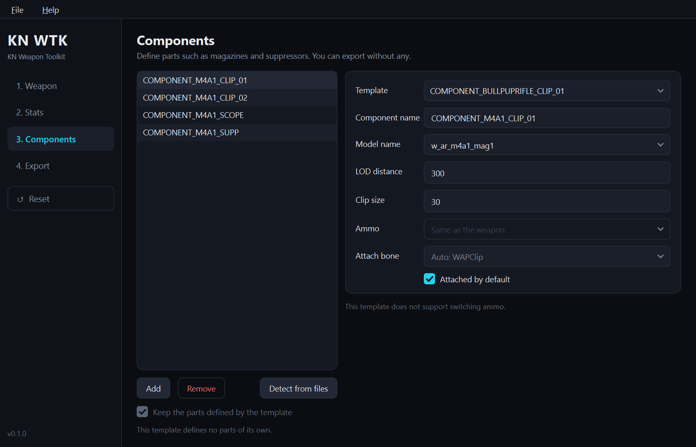
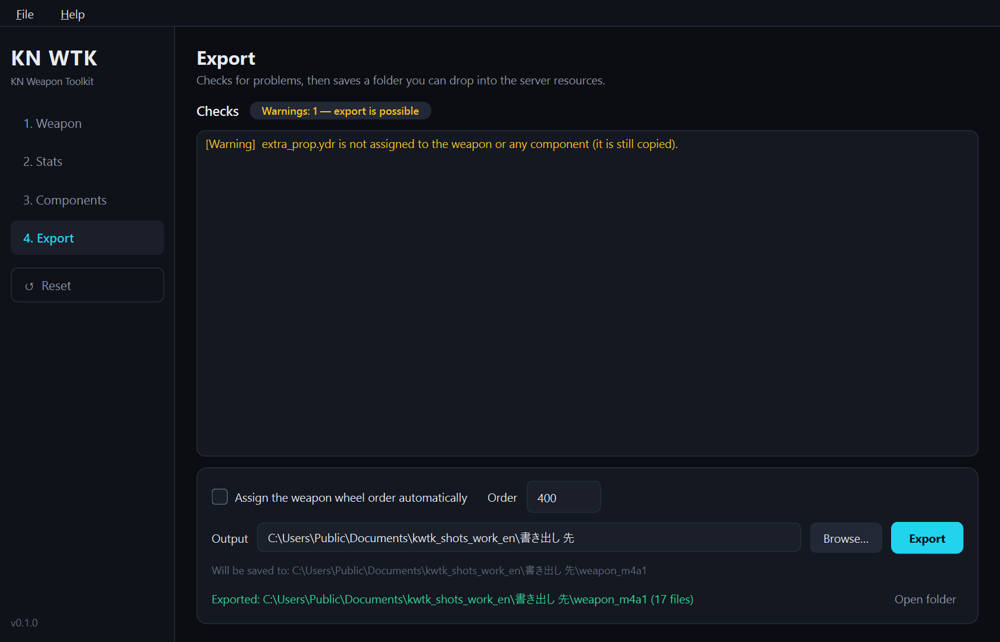

# KN Weapon Toolkit

A Windows tool for creating add-on weapon resources for GTA V / FiveM. Pick a folder with your models
(.ydr / .ytd) and a vanilla weapon to base it on (the template), and it exports a folder — `weapons.meta` and the
other metas plus `fxmanifest.lua` — that you can drop straight into your server's `resources`.

[日本語 README](README.md) · Questions, bug reports and requests: [Discord](https://discord.gg/9jXjrSp5wq)



It is a new implementation in Python / PySide6, modelled on the no longer maintained
[vWeaponsToolkit](https://github.com/rubbertoe98/vWeaponsToolkit) by Robbster and its fork
[FiveM Addon Weapon Tool Kit](https://github.com/Hxrv3y/FiveM-Addon-Weapon-Tool-Kit) by Hxrv3y. It fixes these
problems of the original tool:

- No meta files are exported with some templates, such as the Bullpup Rifle and the RPG
- Models cannot be read from a folder whose path contains non-ASCII characters
- With two or more components, a different component from the selected one gets edited

The full list is in [CHANGELOG.md](CHANGELOG.md) (Japanese).

## Features

- **104 weapon templates and 427 component templates** (including Mk II weapons, newer DLC weapons and Mk II scopes / muzzles / special-ammo magazines / camos)
- **Template import**: add weapons and components from vanilla metas exported with OpenIV / CodeWalker, or from your own add-on weapon metas
- **Attach bones follow the template weapon's vanilla definition** (e.g. Mk II muzzles use `WAPSupp_2`)
- **Stats editing**: damage, range, clip size, time between shots, spread, recoil, bullet speed and more, plus a table of every field the template has
- **Components**: magazines, suppressors, scopes, grips, flashlights. Can be detected from file names (`_mag1` / `_supp` / `_scope` …)
- **Checks before export**: missing models, duplicate names, names that clash with vanilla, unused files and so on
- **Project files** (`.kwtk.json`): reopen, adjust and export again
- **Japanese / English** (follows the OS display language by default), **dark / light** themes

| Stats | Components | Export |
|---|---|---|
|  |  |  |

## Usage

1. Download the zip from [Releases](https://github.com/Kanayu-u/kn_weapontoolkit/releases), extract it and run `kn_weapontoolkit.exe` (keep the `templates` folder next to the exe)
2. **1. Weapon** — select the model folder (or drop it on the window), then set the template, display name, weapon ID and model name. To reuse a vanilla weapon model, just enter its name and leave the folder empty
3. **2. Stats** — change only the values you want (optional)
4. **3. Components** — define parts with "Detect from files" or "Add" (optional)
5. **4. Export** — review the checks, choose an output folder and press "Export"
6. Put the exported folder in your server's `resources` and add `ensure <resource name>` to `server.cfg`
7. To make another weapon, press "Reset" in the sidebar (or File > New / Ctrl+N) to clear everything

Long lists (such as the template list) scroll when you hold the mouse wheel button and move up or down. The farther from where you pressed, the faster; release to stop.

Exported folder:

```
weapon_m4a1/
  fxmanifest.lua
  cl_weaponNames.lua          display name (AddTextEntry)
  meta/
    weapons.meta
    weaponcomponents.meta     only when there are components
    weaponarchetypes.meta
    weaponanimations.meta
    pedpersonality.meta
  stream/                     models and textures
```

### Model file names

| File | Role |
|---|---|
| `<model>.ydr` | Weapon body (required) |
| `<model>_hi.ydr` | High-detail model used when held (optional) |
| `<model>.ytd` / `<model>+hi.ytd` | Textures (not needed if embedded in the model) |
| `<model>_mag1.ydr` etc. | Component models |

## Notes

- The tool only produces the metas and the folder layout. You need to bring your own models and textures
- Whether the exported resource behaves as intended in game depends on the bones of your model (`WAPClip` etc.) and how well it fits the template. Always test on a test server
- It does not register items in any inventory (ox_inventory / qb-inventory …)
- Fire audio is chosen from existing audio sets; custom sounds cannot be added
- Unusual weapons: set the fire type to `PROJECTILE` and the ammo to `AMMO_RPG` (or another projectile) for a gun that fires rockets (fired from a normal gun model, the rocket flies sideways; confirmed with the vanilla carbine and not fixable by settings), or set "Explosion on impact" (e.g. `GRENADE`) together with the damage type `EXPLOSIVE` for explosive shots (with `BULLET` nothing explodes). The time between shots does not change the fire rate (on the vanilla carbine, 0.135 to 0.4 s stayed at about 0.13 s; the pistol at 0.1 or 0.8 s still fired every 0.33 s or so when clicking fast); change the fire animation rate instead (0.5 gave about 0.26 s). Damage, clip size and range were confirmed in game to take the exported values. Spray weapons (fire extinguisher / jerry can) need their animation data: export `weapons.meta` (from `update\update.rpf\common\data\ai`) and `weaponanimations.meta` with OpenIV into one folder and import `WEAPON_FIREEXTINGUISHER` / `WEAPON_PETROLCAN` from it. Movement data (pedpersonality) is not needed; spraying and holding worked in game without it. Always test in game
- The 38 added weapon templates borrow animations and movement from a similar weapon (that data is not in the public sources), so the way they are held may look different from vanilla. The app shows which weapon they borrow from
- Minigun-type weapons are not bundled because no template has similar animations (you can import them yourself)
- Imported templates are saved to `%APPDATA%\kn_weapontoolkit\templates` (File > Import templates…)

## Support

- For questions, requests, or reports like "this weapon is held wrong", join the [Discord (KnScript)](https://discord.gg/9jXjrSp5wq)
- Bugs can also be reported in [Issues](https://github.com/Kanayu-u/kn_weapontoolkit/issues). Please include the template you used and the check results (the list on 4. Export)

## Development

Windows + Python 3.12 or later (tested on 3.14).

```powershell
python -m venv .venv
.venv\Scripts\python -m pip install -r requirements.txt
.venv\Scripts\python main.py                       # run
.venv\Scripts\python -m unittest discover -s tests # tests (GUI tests run when PySide6 is installed)
powershell -ExecutionPolicy Bypass -File scripts\build.ps1   # builds the exe and zip into dist\
```

## Credits and license

- Code: MIT License ([LICENSE](LICENSE))
- `templates/`: from vWeaponsToolkit by Robbster, the fork by Hxrv3y and their contributors, plus definitions cut out of publicly available vanilla metas (all originally game data). Not covered by the MIT license. See [THIRD_PARTY_NOTICES.md](THIRD_PARTY_NOTICES.md)
- This tool is not affiliated with Rockstar Games, Take-Two Interactive or Cfx.re
