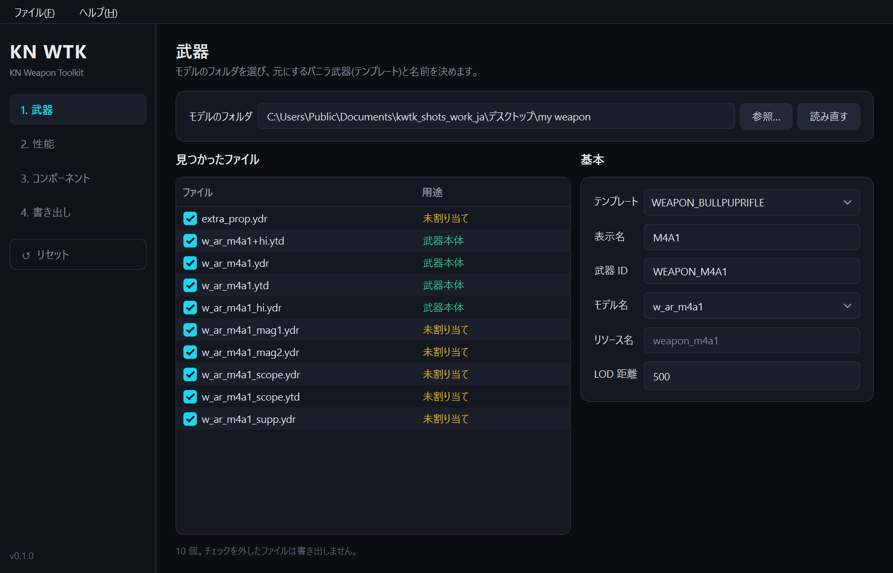
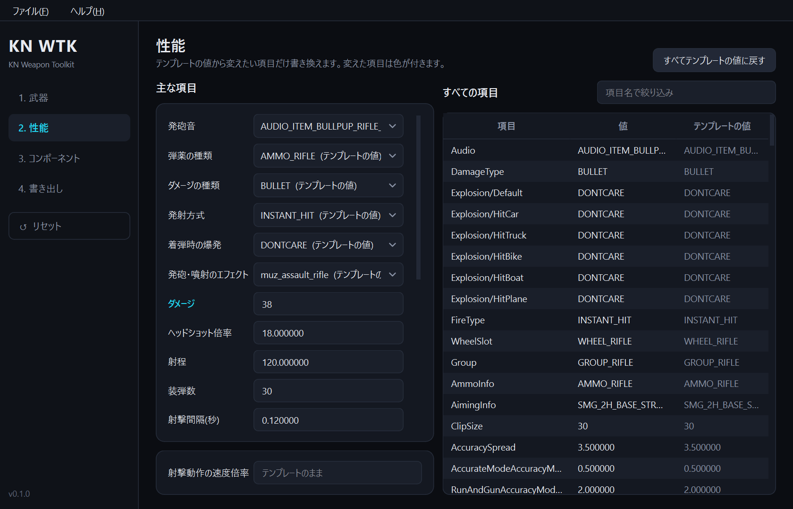
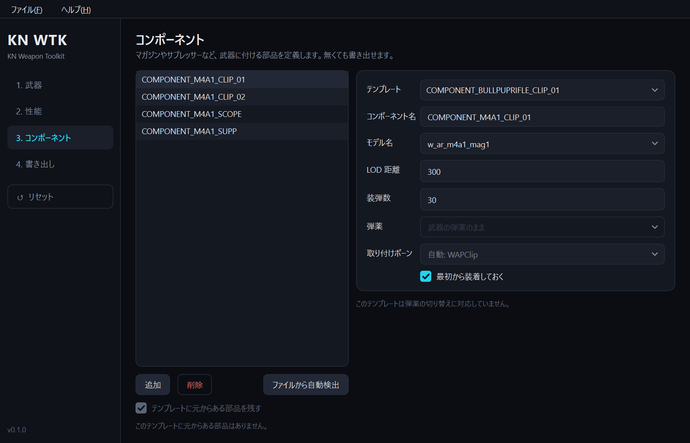
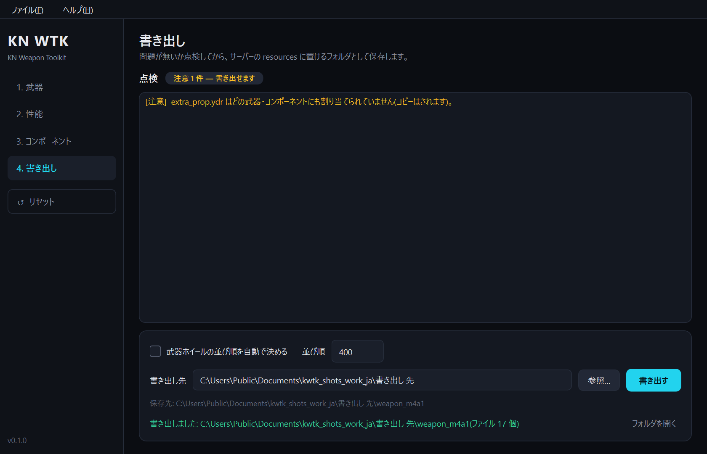

# KN Weapon Toolkit

GTA V / FiveM のアドオン武器リソースを作る Windows 用ツールです。モデル(.ydr / .ytd)の入ったフォルダと、
元にするバニラ武器(テンプレート)を選ぶと、`weapons.meta` などの meta 一式と `fxmanifest.lua` を付けて、
そのままサーバーの `resources` に置けるフォルダとして書き出します。

[English README](README.en.md) ・ 質問・不具合の報告・要望は [Discord](https://discord.gg/9jXjrSp5wq) へ



更新が止まっている [vWeaponsToolkit](https://github.com/rubbertoe98/vWeaponsToolkit)(Robbster)と、そのフォーク
[FiveM Addon Weapon Tool Kit](https://github.com/Hxrv3y/FiveM-Addon-Weapon-Tool-Kit)(Hxrv3y)を参考に、
Python / PySide6 で新しく書き直したものです。元ツールで起きていた次の不具合を直しています。

- ブルパップライフルや RPG などのテンプレートで、meta が書き出されない
- 日本語などを含むパスのフォルダ(`デスクトップ` など)からモデルを読めない
- コンポーネントを 2 個以上追加すると、選んだものと別のコンポーネントが編集される

直した点の一覧は [CHANGELOG.md](CHANGELOG.md) にあります。

## できること

- **104 種の武器テンプレートと 427 種のコンポーネントテンプレート**から選んで書き出す(MK2 系・新しい DLC 武器・MK2 用スコープ/マズル/弾種別マガジン/カモ柄なども含む)
- **テンプレートの取り込み**: OpenIV / CodeWalker で書き出したバニラの meta や、手持ちのアドオン武器の meta から、武器・部品をテンプレートとして追加できる
- **取り付けボーンはテンプレート武器のバニラ定義に合わせる**(例: MK2 系のマズルは `WAPSupp_2`)
- **性能の編集**: ダメージ・射程・装弾数・射撃間隔・ばらつき・反動・弾速・発射方式・着弾時の爆発・発砲エフェクトなどの主な項目と、テンプレートが持つ全項目の一覧表(`Fx/FlashFx` のような一段下の項目も含む)
- **コンポーネント**: マガジン・サプレッサー・スコープ・グリップ・フラッシュライトなど。ファイル名(`_mag1` / `_supp` / `_scope` …)からの自動検出あり
- **書き出し前の点検**: モデルの不足、名前の重複、バニラと同じ名前、どこにも使われないファイルなどを一覧で示す
- **プロジェクトの保存**(`.kwtk.json`): 後から開いて直し、書き出し直せる
- **日本語 / 英語**(既定は OS の表示言語)、**ダーク / ライト**

| 性能 | コンポーネント | 書き出し |
|---|---|---|
|  |  |  |

## 使い方

1. [Releases](https://github.com/Kanayu-u/kn_weapontoolkit/releases) から zip を取得して展開し、`kn_weapontoolkit.exe` を起動する(`templates` フォルダは exe と同じ場所に置いたままにする)
2. **1. 武器** — モデルのフォルダを選ぶ(ウィンドウへのドロップでも可)。テンプレート・表示名・武器 ID・モデル名を決める。バニラ武器のモデルをそのまま使うなら、フォルダは選ばずモデル名だけでよい
3. **2. 性能** — 変えたい値だけ書き換える(省略可)。弾薬の種類や発射方式などは一覧から選ぶ。候補にカーソルを重ねると説明が出るものがある。候補に無い値は一覧の最後の「その他(手入力)…」から入れる
4. **3. コンポーネント** — 「ファイルから自動検出」か「追加」で部品を定義する(省略可)
5. **4. 書き出し** — 点検結果を確認し、書き出し先を選んで「書き出す」
6. できたフォルダをサーバーの `resources` に置き、`server.cfg` に `ensure <リソース名>` を足す
7. 続けて別の武器を作るときは、左の「リセット」(または「ファイル > 新規」/ Ctrl+N)で入力をすべて消す

長い一覧(テンプレートの選択など)は、マウスのホイールを押したまま上下に動かすと送れます。押した位置から離すほど速く、離すと止まります。

書き出されるフォルダの中身:

```
weapon_m4a1/
  fxmanifest.lua
  cl_weaponNames.lua          表示名(AddTextEntry)
  meta/
    weapons.meta
    weaponcomponents.meta     コンポーネントがあるときだけ
    weaponarchetypes.meta
    weaponanimations.meta
    pedpersonality.meta
  stream/                     モデルとテクスチャ
```

### モデルのファイル名

| ファイル | 役割 |
|---|---|
| `<モデル名>.ydr` | 武器本体(必須) |
| `<モデル名>_hi.ydr` | 手に持ったときの高精細モデル(任意) |
| `<モデル名>.ytd` / `<モデル名>+hi.ytd` | テクスチャ(モデルに埋め込みなら不要) |
| `<モデル名>_mag1.ydr` など | コンポーネントのモデル |

## 変わった武器を作る

- **ロケット弾を撃つ銃**: 「性能」で発射方式を `PROJECTILE`、弾薬の種類を `AMMO_RPG` などの飛んでいく弾にする。弾薬は RPG などと共有になります。発射方式と弾薬の組み合わせがバニラに無い形だと、書き出し前の点検で注意が出ます。普通の銃のモデルから撃つと、ロケット弾が横向きのまま飛びます(バニラのカービンで確認。設定では直せません)
- **着弾で爆発する銃**: 「着弾時の爆発」を `GRENADE` などにし、ダメージの種類を `EXPLOSIVE` にする(バニラではレールガンがこの仕組み)。ダメージの種類が `BULLET` のままだと爆発しません
- **連射の速さ**: 「射撃間隔」を変えても連射の速さは変わりません(バニラのカービンで 0.135→0.4 秒にしても約 0.13 秒のまま。ピストルも 0.1 / 0.8 秒にして連打しても約 0.33 秒のまま)。「射撃動作の速度倍率」を変えてください(0.5 で約 0.26 秒になった)。ダメージ・装弾数・射程は書き出した値どおりに効くことを実機で確認しています
- **噴射する武器(消火器型・ガソリン缶型)**: 動作データが同梱できないため、下の「テンプレートの取り込み」でゲームから取り込んでください

どれもゲーム内での動きはテンプレートとの組み合わせ次第です。必ずテストサーバーで確かめてください。

## テンプレートの取り込み

「ファイル > テンプレートを取り込む…」で meta の入ったフォルダを選ぶと、中の武器・部品が一覧になります。
選んだものは `%APPDATA%\kn_weapontoolkit\templates` に保存され、同梱のテンプレートと並んで選べるようになります
(同じ名前なら取り込んだ方が優先)。

- バニラの meta は OpenIV / CodeWalker で `update\update.rpf\common\data\ai` や各 DLC の `common\data\ai` から書き出せます
- ファイル名ではなく中身で種類を見分けるので、フォルダごと選んで構いません
- その武器の動作(weaponanimations)や構え方(pedpersonality)が見つからないときは、近い武器のテンプレートから借ります
- 構え方は全武器入りの大きいファイル(pedpersonality.meta)からでも、その武器の分だけを切り出します

### 消火器・ガソリン缶を取り込む例(OpenIV)
1. OpenIV で次の 2 ファイルを 1 つのフォルダに書き出す(「Export」/「Extract」)。同じ名前が `update\update.rpf` 内にもあれば、そちらを使う。場所が分からなければ OpenIV の検索でファイル名を探す
   - `update\update.rpf\common\data\ai\weapons.meta`(消火器・ガソリン缶の定義)
   - `weaponanimations.meta`(動作)
2. 本ツールの「テンプレートを取り込む…」でそのフォルダを選び、`WEAPON_FIREEXTINGUISHER` / `WEAPON_PETROLCAN` を取り込む
3. テンプレートに選び、モデルを決めて書き出す。噴射の見た目は「発砲・噴射のエフェクト」で変えられます

- 構え方(pedpersonality)はゲーム本体の分が見当たらず、無しで取り込まれます。点検で注意が出ますが、噴射と持ち方は実機で問題ありませんでした
- 消火器の見た目のままでよければ、モデル名に `w_am_fire_exting` と入れるだけで書き出せます(モデルのフォルダは不要)

## 注意

- このツールが作るのは meta と配置だけです。モデルとテクスチャは自分で用意してください
- 書き出したリソースがゲーム内で意図どおり動くかは、モデル側のボーン(`WAPClip` など)やテンプレートとの相性に依存します。必ずテストサーバーで確認してください
- インベントリ(ox_inventory / qb-inventory など)へのアイテム登録は行いません
- 発砲音は既存の音声セットから選ぶだけで、独自の音は追加できません
- 追加した 38 種の武器テンプレートは、動作と構え方を近い武器から借りています(公開されているデータに含まれていないため)。持ち方がバニラと違って見えることがあります。画面に借りた武器の名前が出ます
- ミニガン系は近い動作を持つテンプレートが無いため同梱していません(自分で取り込めば使えます)

## 質問・不具合の報告

- 質問・要望・「この武器の持ち方がおかしい」などの報告は [Discord(KnScript)](https://discord.gg/9jXjrSp5wq) へどうぞ
- 不具合の報告には、使ったテンプレートと、点検の結果(4. 書き出し の一覧)を添えてください

## 開発

Windows + Python 3.12 以降(動作確認は 3.14)。

```powershell
python -m venv .venv
.venv\Scripts\python -m pip install -r requirements.txt
.venv\Scripts\python main.py                       # 起動
.venv\Scripts\python -m unittest discover -s tests # テスト(PySide6 があれば画面のテストも走る)
powershell -ExecutionPolicy Bypass -File scripts\build.ps1   # exe と zip を dist\ に作る
```

- `kn_weapontoolkit/` のうち `ui/` 以外は GUI に依存しません(テンプレート読込・meta 生成・点検)。テストは全テンプレートの書き出しを通します
- `scripts/shots.py` は画面を一通り操作して書き出しまで行う通し確認です(スクリーンショットも撮る)

## クレジットとライセンス

- コード: MIT License([LICENSE](LICENSE))
- `templates/`: Robbster 氏の vWeaponsToolkit、Hxrv3y 氏のフォークとその貢献者によるものと、公開されているバニラの meta から切り出したもの(元はどれもゲームデータ)。MIT の対象外です。詳細は [THIRD_PARTY_NOTICES.md](THIRD_PARTY_NOTICES.md)
- 本ツールは Rockstar Games・Take-Two Interactive・Cfx.re とは関係ありません
